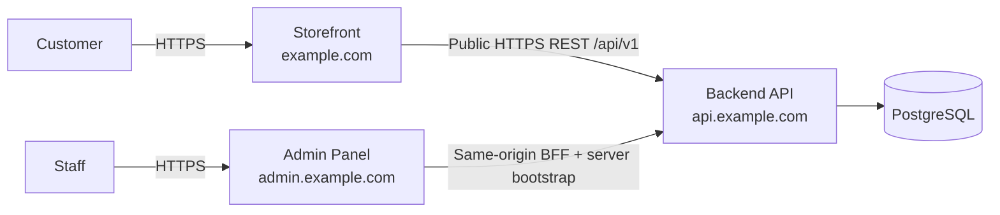

# System Architecture

## Target structure

```text
apps/
  storefront/  # Next.js customer experience
  admin/       # Next.js staff experience
  api/         # NestJS REST API
packages/      # Only proven shared tooling/contracts/components
```

Storefront exists at `apps/storefront`, the independent Admin foundation exists at `apps/admin`, and the empty NestJS API/OpenAPI foundation exists at `apps/api`. The original Next.js starter and its dependency baseline were preserved during Storefront placement, while the root owns Yarn Workspace and Turborepo orchestration.



## Boundaries and rationale

Storefront and Admin are separate Next.js applications because their audiences, security exposure, UI systems, performance/SEO needs, release risk, and navigation differ. They share one API so business rules, authorization, and transactional consistency have one backend authority.

A Yarn Workspaces/Turborepo monorepo supports coordinated contract changes, reuse of the existing dependency installation, shared quality configuration, and selective builds while retaining independent deployability. Sprint 0 configures the existing Yarn environment rather than replacing it. Shared packages are created only after a real cross-application need; application-specific business logic does not migrate into generic packages by default.

The API begins as a domain-oriented **Modular Monolith**. Modules own cohesive behavior and expose explicit internal boundaries while sharing one deployment and database. This minimizes distributed-system cost. Microservices are deferred until measurable ownership, scale, isolation, or deployment requirements justify them.

## Communication boundaries

Admin browsers communicate with same-origin Next.js BFF Route Handlers; `proxy.ts` performs pre-render Backend bootstrap and the BFF forwards versioned HTTPS REST contracts to NestJS. Storefront remains public and follows direct public API contracts until Customer authentication is approved; that future authentication must reuse an independent BFF/Proxy/bootstrap pattern. Explicit exact-origin controls remain part of the server boundary. Clients never connect directly to the database and never serve as the authorization authority. Internal module calls remain in-process initially. External services must be isolated behind purpose-specific integration boundaries with timeouts and failure handling.

Expected production domains are placeholders. Local development uses `http://localhost:3000` for Storefront, `http://localhost:3001` for Admin, and `http://localhost:3002` for API; these browser origins define the future development CORS contract without implementing CORS in the environment task. Authentication defines the accepted cookie and credentialed-CORS baseline, while backend architecture defines minimum observability. Cookie names/development behavior, TLS and deployment topology, CDN/media hosting, providers, and advanced observability tooling remain Open. See the canonical [environment strategy](../environment.md) for value ownership and exposure rules.

See [frontend architecture](frontend-architecture.md), [backend architecture](backend-architecture.md), and [API conventions](../api/conventions.md).
